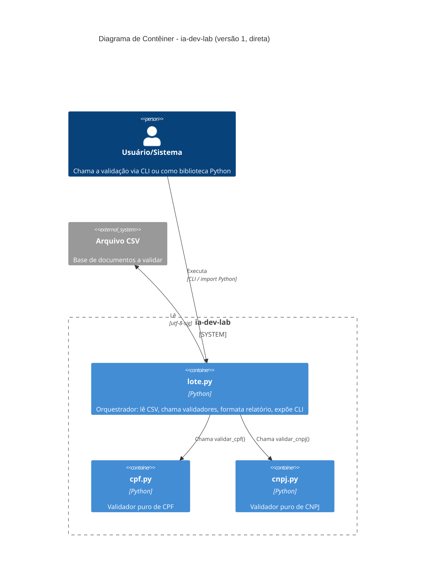
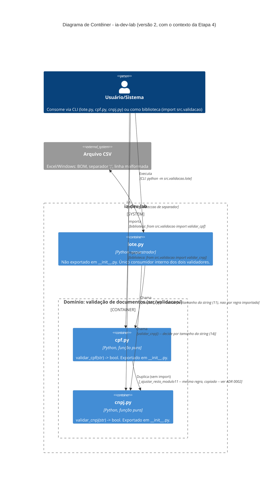

# Etapa 5 — Diagrama C4 de contêiner, em duas versões

## Versão 1 — prompt direto ("gere um diagrama C4 de contêiner deste projeto")

Gerado a partir de um prompt curto, sem o resultado da revisão arquitetural da Etapa 4 como
contexto — só a estrutura de pastas. Está correto, mas trata os três módulos como equivalentes:
mostra as mesmas setas de "chama" para `cpf.py` e `cnpj.py`, e não distingue o que é validador
puro do que é orquestrador, nem mostra que `cpf.py` e `cnpj.py` nunca se importam.

## Versão 2 — mesmo diagrama, com o contexto da Etapa 4 como entrada do prompt

Desta vez o prompt incluiu o resumo de `docs/etapa4-arquitetura.md` — módulos, grafo de
dependências real e os três pontos de acoplamento identificados. O resultado muda em três
pontos concretos: agrupa `cpf.py`/`cnpj.py` num `Container_Boundary` de domínio, separado de
`lote.py` (que é orquestrador, não domínio, e não é exportado publicamente); anota **como** cada
relação acontece (`lote.py` decide por tamanho da string, não por importar a regra); e adiciona
a relação `cpf.py ↔ cnpj.py` que a versão 1 omitiu inteiramente — a duplicação sem import do
cálculo de dígito verificador, que é precisamente o achado da Etapa 6 e o objeto do ADR 0002.

## Qual versão comunica melhor

A versão 2, e a diferença não é estética. A relação mais importante do sistema do ponto de
vista de manutenção — dois módulos que parecem independentes mas compartilham uma regra de
negócio sem nenhuma dependência declarada entre eles — **não existe na versão 1**, porque um
diagrama C4 de contêiner convencional só desenha relações que passam por chamada de função ou
import, e essa relação não é nenhuma das duas. Ela só apareceu porque o prompt da versão 2
carregava o resultado da investigação da Etapa 4/6 como contexto, não porque a ferramenta de
diagramação seja melhor.

Isso expõe um limite do nível "C4 contêiner" em si, não só da execução: em um projeto deste
tamanho — três arquivos, um processo, sem fronteira de deploy — "contêiner" no sentido C4 é uma
unidade grande demais para os relacionamentos que mais importam aqui. As duas versões estão no
nível certo para descrever "quem chama quem", mas o relacionamento que motivou o ADR 0002
(duplicação de uma função interna de 4 linhas) só é visível em nível de componente, não de
contêiner. Um diagrama C4 de componente, com `_ajustar_resto_modulo11` como nó em cada módulo,
teria comunicado isso de forma ainda mais direta — ficou fora do escopo desta etapa, mas é a
lição prática de ter feito as duas versões: qual nível de diagrama comunica uma decisão depende
de em que nível a decisão realmente vive.
